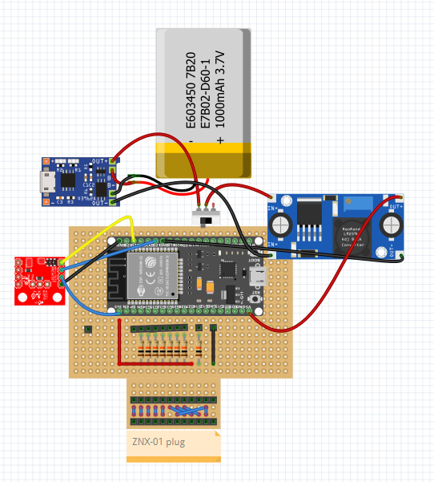

# smart-foot-brace
notes over a smart foot brace based on ZNX-01 and IMU, communicating with a Node-RED UI

## Version 0.2 ESP32 + ZNX + IMU! + UI in Node-RED

[](https://www.youtube.com/watch?v=2a6iHeYnoPc)


|ref|description                               |label  |Manufacturer|MPN               |DPN               |link                                                                                          |
|---|------------------------------------------|-------|------------|------------------|------------------|----------------------------------------------------------------------------------------------|
|1  |Sensore Soletta                           |ZNX-01 |Qiter       |Qiter4hr835o19f   |B08CXZ6QWM        |https://www.amazon.it/intelligente-pressione-Accessorio-tappetino-sensibile/dp/B08CXZ6QWM     |
|2  |MCU                                       |ESP32  |AZDelivery  |B071P98VTG        |B071P98VTG        |https://www.amazon.it/AZDelivery-NodeMCU-Development-Arduino-gratuito/dp/B071P98VTG/          |
|3  | 3.7V 1000mAh Battery                     |Battery|AKZYTUE     |A202106326        |A202106326        |https://www.amazon.it/AKZYTUE-Batteria-ricaricabile-polimeri-connettore/dp/B0983K9BMK/        |
|4  |TP4056 USB C Tipo C Modulo di ricarica (3)|Charger|RED DAMORE  |B0BJQPN3RG        |B0BJQPN3RG        |https://www.amazon.it/RED-DAMORE-ricarica-batteria-protezione/dp/B0BJQPN3RG/                  |
|~5~  |~DC-DC Buck Converter (6)~                  |Buck   |DUBEUYEW    |B0B4SYBGQL        |B0B4SYBGQL        |https://www.amazon.it/DUBEUYEW-Converter-Modulo-alimentazione-regolabile/dp/B0B4SYBGQL        |
|6  |Interruttore a Scorrimento                |SWITCH |RUNCCI-YUN  |B09TVDZ8P2        |B09TVDZ8P2        |https://www.amazon.it/RUNCCI-YUN-Interruttore-Scorrimento-Posizione-Elettronici/dp/B09TVDZ8P2/|
|7  |FILAMENT                                  |3D     |SUNLU       |‎SLUK-TPU-WT-0.5KG|‎SLUK-TPU-WT-0.5KG|https://www.amazon.it/SUNLU-Filament-Dimensional-Accuracy-Printing/dp/B07R6PMXSP              |
|8  |IMU LSM9Ds1                               |IMU    |Sparkfun    |SEN-13284         |SEN-13284         |https://www.sparkfun.com/products/retired/13284                                               |
|9  |MODULO DC-DC BOOST CONVERTER 2 AMPERE     |Buck   |Pinto       |056.044.3838      |056.044.3838      |                                                                                              |



## Version 0.1 ESP32 + ZNX + UI in Node-RED


## Come si usa il prototipo 1?

Per poter visualizzare sul PC i dati della suola smart occorre:

### Lato Arduino (Opzionale)

* installare Arduino
* installare il [core dell'ESP32](https://randomnerdtutorials.com/installing-the-esp32-board-in-arduino-ide-windows-instructions/)

### Lato Node-RED (obbligatorio)

* [installare Node-RED](https://nodered.org/docs/getting-started/windows) sulla propria macchina
* installare il node per la gestione della [porta seriale](https://flows.nodered.org/node/node-red-node-serialport)
* installare il nodo [dashboard](https://flows.nodered.org/node/node-red-dashboard)
* installare il nodo per la gestione degli [svg nella dashboard](https://flows.nodered.org/node/node-red-contrib-ui-svg) 

Una volta fatte queste operazione e importata la prima versione della UI, dovrete correttamente identificare la COM che il vostro PC ha assegnato all'ESP32. Selezionandola dal dropdown del nodo dovreste essere in grado di vedere i dati vairare in tempo reale nella dashaboard.

Al momendo la comunicazione é seriale, i dati vengono inviati in JSON, in questo protocollo:

```
{
    "vers" : 1,
    "gfrValue8" : num,
    "gfrValue7" : num,
    "gfrValue6" : num,
    "gfrValue5" : num,
    "gfrValue4" : num,
    "gfrValue3" : num,
    "gfrValue2" : num,
    "gfrValue1" : num
}
```

# TODO:

* [ ] [Implementare correttamente una IMU](https://github.com/vongomben/smart-foot-brace/issues/1)
* [ ] [Capire che PC usare nell'installazione](https://github.com/vongomben/smart-foot-brace/issues/2)
* [ ] [Passare a Arduino NANO 33 IoT](https://github.com/vongomben/smart-foot-brace/issues/3) (possibilità)
* [ ] [Acquisti](https://github.com/vongomben/smart-foot-brace/issues?q=is%3Aissue+is%3Aopen+label%3Aacquisti)
* [ ] [Definire comportamenti ed usi sbagliati del tutore](https://github.com/vongomben/smart-foot-brace/issues/5)
* [ ] [approvare la colorazione della heatmap](https://github.com/vongomben/smart-foot-brace/issues/6)
* [ ] [prototipare (anche su carta) l'interfaccia che si vuole raggiungere (Con almeno tre livelli di completezza: good better best)](https://github.com/vongomben/smart-foot-brace/issues/9)
* [ ] [Creazione di una BOM](https://github.com/vongomben/smart-foot-brace/issues/7) (meglio su gDrive) che faccia elendo dei pezzi in essere
* [ ] [File 3D del gesso](https://github.com/vongomben/smart-foot-brace/issues/8)


## Various links 

* [ZNX-01 Sensing Mat,Foot Pressure Sensor Insole Sensor Plastic Sensing Mat Thin Film Pressure Sensor Thin Film Intelligent Insole Sensor Foot Pressure Sensor](https://www.amazon.com/ZNX-01-Sensing-Pressure-Plastic-Intelligent/dp/B09PF5TNS8)  
* [Gait Phase Recognition Using Fuzzy Logic Regulation with Multisensor Data Fusion](https://www.hindawi.com/journals/js/2021/8776059/)
* [Foot Pronation Detection Based on Plantar Pressure Measurement](https://www.researchgate.net/publication/346509459_Foot_Pronation_Detection_Based_on_Plantar_Pressure_Measurement)


## Specification

* Item Type	Sensing Mat
* Material	Plastic
* Model	ZNX-01
* Thickness	Approx. 0.45mm / 0.02in
* Single Point Range	Approx. 10 kg / 22 lb
* Response Point Range	Approx. 400 g / 14.1 oz
* Durability	>1 million times
* Initial Resistance	>10MQ (no load)
* Test Voltage	Typical value DC3.3V
* Response Time	<1ms
* Recovery Time	<15ms
* Working Temperature	-20℃~60℃
* Electromagnetic Interference	No generation
* Electrostatic Discharge ESD	Not sensitive


